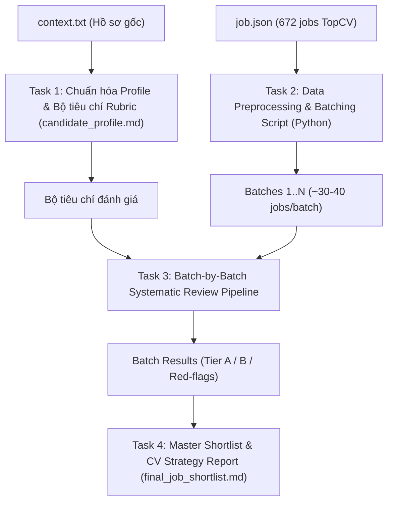

# TopCV Job Matching & Batch Review Pipeline Implementation Plan

> **For agentic workers:** REQUIRED SUB-SKILL: Use superpowers:subagent-driven-development (recommended) or superpowers:executing-plans to implement this plan task-by-task. Steps use checkbox (`- [ ]`) syntax for tracking.

**Goal:** Xây dựng quy trình và bộ công cụ tự động hóa để chuẩn hóa hồ sơ ứng viên từ `context.txt`, tiền xử lý và chia 672 việc làm TopCV thành các batch, sau đó tiến hành phân tích & chấm điểm từng batch theo thang tiêu chí cá nhân hóa để chọn ra danh sách việc làm phù hợp nhất (Shortlist).

**Architecture:** Quy trình gồm 4 tầng: (1) **Profile & Rubric Alignment** (chuẩn hóa profile + bộ tiêu chí chấm điểm 100 điểm), (2) **Job Preprocessing & Batching** (script Python bóc tách HTML, làm sạch văn bản, trích xuất thuộc tính chính và chia 672 jobs thành 14-20 batch có cấu trúc), (3) **Systematic Batch Review** (đánh giá từng batch theo ma trận đa tiêu chí, phân loại Tier A/Tier B/Tier C kèm lý do chi tiết), và (4) **Master Report & CV Matching Strategy** (tổng hợp bảng xếp hạng Top job, phân loại theo nhóm vị trí và chiến lược ứng tuyển).

**Tech Stack:** Python 3 (json, re, html, pathlib), Markdown Report Generation.

---

## Logical Workflow Overview

---

## File Structure

- `candidate_profile.md`: Tài liệu chân dung nghề nghiệp chuẩn hóa, trọng số chấm điểm và từ khóa mục tiêu trích xuất từ `context.txt`.
- `scripts/preprocess_jobs.py`: Script đọc `job.json`, làm sạch HTML trong JD/Requirement, trích xuất metadata (Lương, Địa điểm, Yêu cầu kinh nghiệm) và phân chia thành các file batch JSON/Markdown trong thư mục `batches/`.
- `batches/batch_XX.json`: Dữ liệu việc làm đã làm sạch theo từng batch (khoảng 35 jobs/batch).
- `reviews/review_batch_XX.md`: Báo cáo đánh giá chi tiết từng batch (điểm số, phân loại Tier A/B/C, phân tích ưu/nhược điểm từng job).
- `final_job_shortlist.md`: Báo cáo tổng hợp cuối cùng chứa Top công việc phù hợp nhất, phân nhóm theo lĩnh vực và hướng dẫn điều chỉnh CV.

---

## Tasks

### Task 1: Chuẩn hóa Profile và Thiết lập Bộ tiêu chí Đánh giá (Scoring Rubric)

**Files:**
- Create: `candidate_profile.md`

- [ ] **Step 1: Trích xuất và cấu trúc hóa toàn bộ dữ liệu từ `context.txt`**
  - **Nền tảng:** Cử nhân Bất động sản (ĐH Kinh tế Quốc dân - NEU), TOEIC 855 (đọc/viết tốt, đang rèn luyện nghe/nói), có kinh nghiệm Sales BĐS thực chiến (tư vấn 1-1, research dự án/quy hoạch, viết content bán hàng/social).
  - **Định hướng chuyển dịch:** Tránh telesales lạnh (cold call hàng loạt), tránh phụ thuộc 100% hoa hồng, tránh môi trường thuần nhập liệu đơn điệu hoặc phân tích số liệu/data quá nặng; hướng tới: Vận hành / Điều phối (Coordination) > Nghiên cứu / Phát triển dự án (Research/Development) > Account Management / B2B Sales tư vấn giải pháp > Customer Success > Marketing / Content.
  - **Ràng buộc cứng (Hard Filters):**
    - Địa điểm: Hà Nội / Hybrid / Remote.
    - Mức lương cứng (Base salary): Từ 8 - 10 triệu trở lên (linh hoạt 7-8 triệu nếu công ty lớn có lộ trình đào tạo rõ ràng).
    - Không phải dạng tuyển dụng đại trà lừa đảo / telesales 100-200 cuộc mỗi ngày / không lương cứng.

- [ ] **Step 2: Xây dựng Thang đo Điểm phù hợp (Fit Score 0 - 100)**
  - **Nhóm vị trí & Tính chất công việc (40 điểm):**
    - 40đ: Sales Coordinator, Project Coordinator, B2B Account Executive (tư vấn giải pháp), Customer Success, Market Research / Project Development.
    - 25-30đ: Marketing Executive, Content/Social Media, Sales B2B tổng quát.
    - 10-15đ: Sales B2C cần gặp khách nhiều.
    - 0đ (Loại): Telesales thuần, Data Analyst nặng, Kế toán, Lập trình/Kỹ thuật thuần.
  - **Nền tảng & Kỹ năng bổ trợ (30 điểm):**
    - Tận dụng được kiến thức BĐS / Tài chính / Kinh tế (+15đ).
    - Yêu cầu / ưu tiên tiếng Anh (TOEIC 855 là lợi thế lớn) (+10đ).
    - Khả năng viết lách, nghiên cứu, tổng hợp thông tin (+5đ).
  - **Mức lương & Chế độ đãi ngộ (15 điểm):**
    - Lương cứng rõ ràng >= 8-10M (+15đ).
    - Lương thỏa thuận / cạnh tranh theo năng lực (+10đ).
    - Lương dưới 8M hoặc chỉ ghi hoa hồng không rõ lương cứng (0-5đ).
  - **Môi trường & Cơ hội phát triển (15 điểm):**
    - Có lộ trình thăng tiến rõ ràng, có quy trình đào tạo/mentor (+15đ).
    - Mô tả công việc rõ ràng, công ty uy tín (+10đ).

- [ ] **Step 3: Ghi file `candidate_profile.md`**

---

### Task 2: Xây dựng Script Tiền xử lý Dữ liệu & Chia Batch (Preprocessing & Batching)

**Files:**
- Create: `scripts/preprocess_jobs.py`
- Output: Thư mục `batches/batch_01.json` .. `batches/batch_19.json`

- [ ] **Step 1: Viết script `scripts/preprocess_jobs.py`**
  - Đọc 672 jobs từ `job.json`.
  - Làm sạch mã HTML (`
`, `<ul>`, `<li>`, `&amp;`, ...) thành văn bản thô (clean plain text) cho `job_description`, `job_requirement`, `job_benefit`.
  - Chuẩn hóa các trường: `id`, `title`, `company_name`, `salary`, `locations`, `experience`, `url`, `cleaned_description`, `cleaned_requirement`, `cleaned_benefit`.
  - Chia 672 jobs thành 19 batch (~35 jobs/batch) hoặc 14 batch (~48 jobs/batch). Lưu dưới dạng JSON gọn gàng và dễ đọc.

- [ ] **Step 2: Chạy script và kiểm tra output**
  - Chạy `python scripts/preprocess_jobs.py`.
  - Kiểm tra xem 672 jobs đã được phân bổ đầy đủ vào các batch mà không bị sót hoặc lỗi format UTF-8.

---

### Task 3: Quy trình Đánh giá & Rà soát Từng Batch (Batch-by-Batch Review)

**Files:**
- Output: `reviews/review_batch_01.md` đến `reviews/review_batch_XX.md`

- [ ] **Step 1: Đọc và rà soát từng batch việc làm**
  - Với mỗi batch (35-48 jobs), thực hiện đối chiếu song song:
    1. **Sàng lọc sơ bộ (Quick Filter):** Loại bỏ ngay các job lệch ngành hoàn toàn (Dev, Kỹ sư xây dựng, Kế toán trưởng, Telesales gọi data lạnh...).
    2. **Đánh giá chuyên sâu (Deep Review):** Đọc kỹ JD, Requirement và Quyền lợi của các job tiềm năng.
    3. **Chấm điểm & Xếp loại:**
       - **Tier A (Điểm >= 75/100 - Rất phù hợp):** Khớp định hướng (Coordinator, Research, B2B Account, CS), lương tốt, tận dụng được tiếng Anh/BĐS, môi trường phát triển.
       - **Tier B (Điểm 60 - 74/100 - Có thể cân nhắc):** Phù hợp 1 phần (ví dụ Marketing/Content hoặc Sales B2B cần thêm chút kinh nghiệm), cần cân nhắc môi trường hoặc mức lương.
       - **Tier C / Reject (< 60/100):** Red flag, không phù hợp tính cách, áp lực không đúng mục tiêu.

- [ ] **Step 2: Trích xuất phân tích chi tiết cho từng Job Tier A & Tier B**
  - Tên job, Tên công ty, Link ứng tuyển, Mức lương.
  - **Điểm mạnh (Pros):** Tại sao vị trí này hợp với hồ sơ (kỹ năng gì, lợi thế gì).
  - **Lưu ý / Rủi ro (Cons / Risks):** Điểm cần hỏi kỹ khi phỏng vấn (KPI thế nào, có phải gọi điện nhiều không).
  - **Gợi ý điểm nhấn CV (CV Highlight):** Điểm gì trong hồ sơ ứng viên nên đưa lên đầu khi nộp job này.

---

### Task 4: Tổng hợp Báo cáo Master Shortlist & Chiến lược Ứng tuyển

**Files:**
- Create: `final_job_shortlist.md`

- [ ] **Step 1: Tổng hợp danh sách Top Jobs từ tất cả các batch**
  - Gom toàn bộ các vị trí Tier A và Tier B sáng giá nhất.
  - Phân loại theo 5 nhóm nghề nghiệp mục tiêu:
    1. *Nhóm 1: Sales Coordinator / Sales Support / Sales Admin*
    2. *Nhóm 2: B2B Account Executive / Business Development (Consultative)*
    3. *Nhóm 3: Project Coordinator / Real Estate Research / Development Assistant*
    4. *Nhóm 4: Customer Success / Client Experience*
    5. *Nhóm 5: Marketing Coordinator / Content Specialist*

- [ ] **Step 2: Xây dựng Ma trận Chiến lược Ứng tuyển (Action Plan)**
  - Bảng tổng kết Top việc làm kèm mức độ ưu tiên nộp đơn (Priority 1, 2, 3).
  - Khuyến nghị điều chỉnh 3 phiên bản CV (CV thiên về Coordinator, CV thiên về B2B Account, CV thiên về Research/BĐS) dựa trên hồ sơ sẵn có và chứng chỉ TOEIC 855.
  - Danh sách các câu hỏi thông minh để ứng viên hỏi nhà tuyển dụng nhằm phát hiện red-flag (ví dụ: cơ cấu KPI, tỷ lệ telesales, quy trình onboarding).

---

## Verification Plan

### Automated Checks
- Chạy script kiểm tra phân tách dữ liệu:
  `python -c "import glob, json; files=glob.glob('batches/*.json'); total=sum(len(json.load(open(f, encoding='utf-8'))) for f in files); print(f'Total jobs processed: {total}')"`
  -> Đảm bảo tổng số jobs trong các batch đúng bằng 672.

### Review Validation
- Kiểm tra lại danh sách Tier A để đảm bảo không lọt bất kỳ job nào chứa các red flag (lương 100% hoa hồng, telesales 100+ cuộc/ngày).
- Kiểm tra tính xác thực của link TopCV và thông tin công ty.
